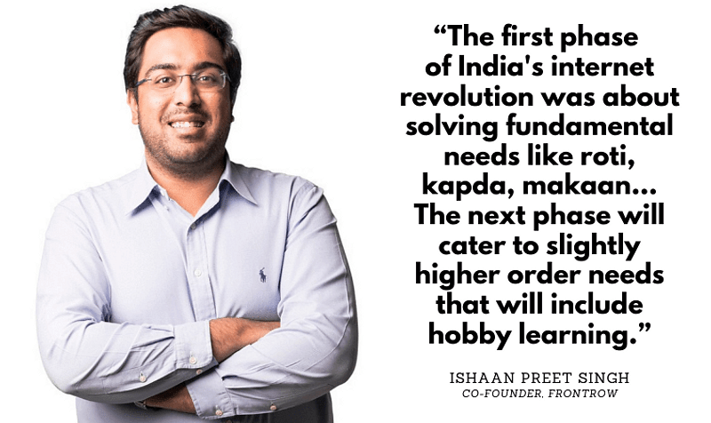

# My process of end-to-end ideating and creating AD creatives

---

First of all here is the thing I made:

The process was end-to-end i.e. coming up with the copy, design, and finally making the designs in [Figma](https://www.figma.com/).

A basic profile of the Startup for which I created these Ads:

FrontRow is a startup in the D2C EdTech domain. It is trying to sell celebrity courses and building a community around them. [Link](https://yourstory.com/2020/12/deepika-padukone-backed-startup-hobby-learning-edtech) to an article if you want to know more about the startup. Quoting the founder that drives across the point pretty well:

From the same [article](https://yourstory.com/2020/12/deepika-padukone-backed-startup-hobby-learning-edtech)

Major point - we are focusing on hobby learning. Now imagine this - you want to learn how to Sing or how to play cricket. Do you think you wanna do it alone watching some videos? Of course not. You want to test yourself, you want to compete and collaborate with others. You want to have a *community* around the hobby that you want to pursue. What’s the point of learning to sing if you don’t have an audience to sing to? What’s the point of learning to play cricket if you don’t have someone to play with?

Community is an important aspect of hobby learning. It is something which a learner *wants*. A good advertisement is built upon a *want.*

---

Here was my process:

### **Step 1: Take inspiration and ideate**

I was not constrained to meet any specific requirements. There was the surficial need that it has to be an image Ad for Instagram, Facebook, and Google. They had to be of specific dimensions like - 1080 px * 1080 px (for Instagram) or 1200 px * 628 px (for Google). Also, they had to advertise - community part of the app. Yet, creatively there were no constraints like following a particular color scheme. Without constraints, the project can go in many directions. It was important for me to ideate the design and arrangement of elements beforehand.

An important factor that needs to be noted - design of the ads must be attractive. Design solves problems. Here the problem is - if the creatives don’t look attractive, no one is going to click on it. Hence I decided to go for - polished-looking ads rather than say *accessible* ads with simple designs and copy.

For inspiration, I looked at several ads. I wanted ads to look premium and convey the point pretty well. They should not be too *texty*. I liked [Slack ads](https://dribbble.com/shots/15008439-Bold-Banners-for-Demand-Gen) and [Shopify Ads](https://dribbble.com/shots/6762036-Gmail-Ad-Desgn). Hence decided to go with something along those lines. While going through a lot of designs, I kept evaluating how it would look with needs in place. Kept thinking about what copy or element I can use in my version.

### **Step 2: Finalize on design and arrangement of elements**

Once decided which direction I want to go, I started making some preliminary versions on the tool (Figma).

Process: My idea was to keep a single headlining copy and no subtext. But the ads would then end up looking like motivational posters!

So, change of plans - we had to have subtext. Another important reason was highlighting product features. A headlining motivational kind of quotes couldn’t do much in - *explaining the feature*.

Another important part of the process - how to decrease the amount of repeating text? Designs in the initial versions had the text of ‘Join Communities of’ with community names below it. This text was repeating in every design. From the point of view of the advertisement, this text was important. Communities are built upon hobbies. Advertisement couldn’t be vague - join FrontRow community. They had to tell the names of the community at least. We had 4 communities - Singing and Music, Rap, Comedy, and Cricket. The idea I came up with - adding a mockup with the community screen which has a list of all the communities. It conveys the UI of the app as well as different community names.

### **Step 3: Final Design and Copy**

Once the basic design is done, I wanted to finalize the design. Idea was to have a template and reuse it for different copy with different color schemes. Here are few notes about the final design.

- Design has clear hierarchy structure. Left alignment for all the text with a comfortable line spacing making it easier to scan. Clear bold CTA.
- The headlining copy is the first thing which drives people in. Hence to highlight it more, its background is of a darker color than the background for the other part of the design.
- Logo had to be of sufficient size. So that people don’t forget the name of the app!
- Used [Jakarta Sans](https://tokotype.github.io/plusjakarta-sans/) as the Font. Its a not widely known open-source font which looks top-notch.
- Used [http://khroma.co/](http://khroma.co/) to get the color combinations. Also did some changes on my own to get everything looking good to my satisfaction.
- Went for a mockup of the app to counter the problem of just text and text in the whole ad. Link to the [mockup](https://gumroad.com/l/minimalmockup185x9).

## **Copywriting**

Copywriting is something that looks trivial. But it is pretty hard to get perfect.

My process: Before even writing anything, I like to think about the brief. The process was to write the brief on my own. Say the general brief was that write copy for Ads highlighting certain features of the app. I would rethink it from a feature by feature basis.

For example, we want to highlight a feature of chat - I would think of it as

- **Headlining copy** is needed to attract the reader. Something provocative or something which attends to the reader’s problem.
- **Subtext** needed to tell about the feature and qualities of that feature.
- Clear **CTA** of what people must do after viewing the AD.

To come up with headlining copy I took inspiration from Pinterest. I searched motivational quotes on topics like creativity, improvement. On doing some changes in them they became perfect for our use.

For the subtext the process was pretty simple. I made a lot versions and keep doing improvements to them for clarity and brevity.

CTA was usually Download the App now.

---

This was my process. **Thanks for reading!**